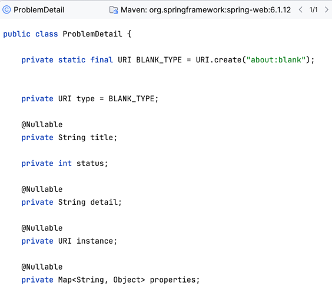

# PoC Manejo De Detalle Problemas APIs HTTP

Esta PoC se basa en probar el RFC 9457 `Problem Details for HTTP APIs` detallado en <a href="https://datatracker.ietf.org/doc/html/rfc9457">RFC 9457</a>

# Primeros Pasos

## Problema

El problema que teniamos antes del RFC 9457 es que cada uno define de manera particular los campos/atributos/detalles
que uno definira como payload para la respuesta con el detalle del problema.

## Propuesta Solucion Spring Framework

El RFC 9457 define como linea base los siguientes atributos:
- type
- title
- status
- detail
- instance
- extensions (properties)



## Implementacion

### Integracion para Tracer 

Si bien con el RFC 9457 `Problem Details for HTTP APIs` se detalla el contrato comun, para casos de manejo de Trace 
este proyecto usa `micrometer-tracing-bridge-brave` mediante:

```java
private final Tracer tracer;

final ProblemDetail problemDetail =
        ProblemDetail.forStatusAndDetail(HttpStatus.CONFLICT, ex.getMessage());
problemDetail.setProperty("traceid", tracer.currentSpan().context().traceIdString());
```

### Manejo de Propagaciones de Variables de Negocio

Aegregamos las correlacion de las propagaciones mediante:

```properties
management.tracing.enabled=true
management.tracing.sampling.probability=1.0
management.tracing.baggage.correlation.enabled=true
management.tracing.baggage.correlation.fields=idToPropagate01, idToPropagate02
management.tracing.baggage.remote-fields=idToPropagate01, idToPropagate02
```

La propagacion de variables de negocio la definimos mediante:

```java
@Bean
public CurrentTraceContext.ScopeDecorator mdcScopeDecorator(
        @Qualifier("idToPropagate01") BaggageField idToPropagate01,
        @Qualifier("idToPropagate02") BaggageField idToPropagate02) {
    return MDCScopeDecorator.newBuilder()
            .clear()
            .add(
                CorrelationScopeConfig.SingleCorrelationField.newBuilder(idToPropagate01)
                        .flushOnUpdate()
                        .build())
            .add(
                CorrelationScopeConfig.SingleCorrelationField.newBuilder(idToPropagate02)
                        .flushOnUpdate()
                        .build())
            .build();
}
```

Y la actualizamos mediante:

```java
    @NonNull
    @Qualifier("idToPropagate02")
    private final BaggageField idToPropagate02; // information that we need to propagate

    @GetMapping("/testme")
    public List<String> callMe() {
        idToPropagate02.updateValue("id-propagate-0002");
        log.info("Proceso /testme");
        return List.of("Uno", "Dos", tracer.currentSpan().context().traceIdString());
    }
```

Y lo escribimos mediante:
```lombok.config
<configuration>
    <springProperty scope="context" name="service" source="spring.application.name"/>
    <property scope="context" name="hostname" value="${HOSTNAME}"/>
    <appender name="console" class="ch.qos.logback.core.ConsoleAppender">
        <encoder class="net.logstash.logback.encoder.LogstashEncoder">
            <timeZone>UTC</timeZone>
            <includeMdcKeyName>traceId</includeMdcKeyName>
            <includeMdcKeyName>idToPropagate01</includeMdcKeyName>
            <includeMdcKeyName>idToPropagate02</includeMdcKeyName>
            <includeContext>false</includeContext> <!--To exclude HOSTNAME -->
            <customFields>{"hostname":"${HOSTNAME}","service":"${service}"}</customFields>
        </encoder>
    </appender>
    <root level="info">
        <appender-ref ref="console"/>
    </root>
</configuration>
```